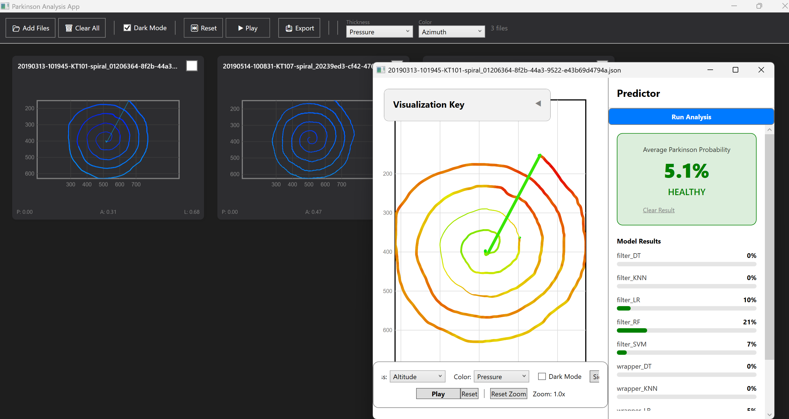

# ParkinsonAppWindows
 
A Windows desktop application for **visualizing, analyzing, and exporting handwriting drawings** (e.g. spirals and lines drawn on a graphics tablet) to support the detection of Parkinson's disease.
 
The app loads pen-movement recordings (coordinates, pressure, tilt, azimuth), renders them as rich visualizations, extracts a set of biomechanical features, and runs them through an ensemble of ONNX machine-learning models to produce a probability of the disease.
 
> ⚠️ **Disclaimer:** This is an educational/research tool and is **not a medical device**. Its output must not be used for actual diagnosis.
 
---
 
## Screenshot
 

 
*Loaded spiral drawings with color-coded pen data (left), the detailed analysis window with the ONNX model ensemble and per-model probabilities (right).*
 
---
 
## Features
 
- **Data loading** from JSON recordings (multiple sessions at once).
- **Visualization** of the pen trajectory on a custom-rendered canvas (`DrawingCanvas`) with:
  - configurable line **thickness** parameter (pressure, velocity, etc.);
  - configurable line **color** parameter (azimuth, tilt, etc.);
  - grid, legend, and light/dark theme support.
- **Animation** of the drawing over time (replays the stroke as it was drawn, ~60 FPS).
- **Feature extraction** (`FeatureExtractor`) — 20 pen-movement features (pressure, velocity, acceleration, tremor/shake, etc.).
- **ML inference** via an ensemble of **ONNX models** (`OnnxService`), averaging the probabilities into a final `PARKINSON` / `HEALTHY` verdict.
- **Export** of results to **PNG** (raster), **SVG** (vector), and a **PDF** report.
---
 
## Tech Stack
 
- **.NET 10** (`net10.0-windows`)
- **WPF** with the **MVVM** architecture
- [Microsoft.ML.OnnxRuntime](https://onnxruntime.ai/) `1.23.2` — ML model inference
- [MathNet.Numerics](https://numerics.mathdotnet.com/) `5.0.0` — numerical feature computation
---
 
## Project Structure
 
```
ParkinsonAppWindows/
├── App.xaml                # Entry point, global resources/styles
├── MainWindow.xaml         # Main window (session list, toolbar)
├── Controls/
│   ├── DrawingCanvas.cs    # Custom element that renders the pen trajectory
│   └── LegendControl.xaml  # Color/thickness legend
├── Converters/
│   └── ValueConverters.cs  # XAML binding converters (theme, visibility, etc.)
├── Helpers/
│   └── ColorHelper.cs      # Color utilities
├── Models/                 # Data models (DrawingDataFile, DrawingPoint, DrawingParameter …)
├── Services/
│   ├── FeatureExtractor.cs # Extracts 20 features from the trajectory
│   ├── OnnxService.cs      # Runs ONNX model inference
│   ├── BitmapExporter.cs   # PNG export
│   ├── SvgExporter.cs      # SVG export
│   └── SimplePdfExporter.cs# PDF report export
├── ViewModels/
│   ├── MainViewModel.cs    # Main window logic, file loading
│   ├── SessionViewModel.cs # A single loaded session/drawing
│   ├── DetailViewModel.cs  # Detailed analysis + ONNX ensemble
│   ├── ExportViewModel.cs  # Export logic
│   └── RelayCommand.cs     # ICommand implementation for MVVM
├── Views/
│   ├── DetailWindow.xaml   # Detailed analysis window
│   └── ExportWindow.xaml   # Export window
└── ModelsONNX/             # Trained ONNX models (not in the repo — see below)
```
 
---
 
## Machine Learning Models
 
The app looks for a `ModelsONNX` folder next to the executable and loads **all** `*.onnx` files from it, then averages their predictions (ensemble).
 
Expected models (two groups — `filter_*` and `wrapper_*` — for different algorithms):
 
```
filter_DT.onnx    wrapper_DT.onnx     # Decision Tree
filter_KNN.onnx   wrapper_KNN.onnx    # K-Nearest Neighbors
filter_LR.onnx    wrapper_LR.onnx     # Logistic Regression
filter_RF.onnx    wrapper_RF.onnx     # Random Forest
filter_SVM.onnx   wrapper_SVM.onnx    # Support Vector Machine
```
 
Each model takes a vector of **20 features** (order defined in `FeatureExtractor.FEATURES_ORDER`) and returns the probability of the "Parkinson" class. The final probability is the mean across all models; the verdict is `PARKINSON` when the value is ≥ 50%.
 
---
 
## Input Data Format
 
The app reads `.json` files with the following structure (deserialized into `DrawingDataFile`):
 
```json
{
  "Data": [
    [
      { "T": 0.0, "X": 120.5, "Y": 340.2, "P": 512, "A": 1200, "L": 700 }
    ]
  ]
}
```
 
where `Data` is a list of strokes, and each stroke is a list of points:
 
| Field | Meaning |
|-------|---------|
| `T`   | Timestamp of the point |
| `X`   | X coordinate |
| `Y`   | Y coordinate |
| `P`   | Pen pressure |
| `A`   | Pen azimuth |
| `L`   | Pen tilt (altitude) |
 
---
 
## Getting Started
 
### Requirements
- Windows
- [.NET 10 SDK](https://dotnet.microsoft.com/download)
- Visual Studio 2022+ (or newer) with .NET / WPF support
### Build & Run
 
```bash
# Clone the repository
git clone <repository-URL>
cd parkinson-app-windows/ParkinsonAppWindows
 
# Restore dependencies and build
dotnet restore
dotnet build
 
# Run
dotnet run
```
 
 
---
 
## Usage
 
1. Click **Load Files** and select one or more `.json` drawing files.
2. Adjust the visualization — pick the **color** and **thickness** parameters, toggle animation and grid.
3. Open the detailed analysis to run the ONNX ensemble and view the per-model probability and the final verdict.
4. Optionally export the result to **PNG**, **SVG**, or **PDF**.
---
 
## Credits
 
Built as a student project (TalTech, Computer Science).
 
- **Application, visualization & ML integration** — *Kristiina Dunajeva*
  (WPF/.NET app, custom spiral rendering, MVVM architecture, feature extraction, ONNX inference integration, PNG/SVG/PDF export)
- **ONNX model training** — *teammate*
- **Dataset & project concept** — *course supervisor, Taltech*


